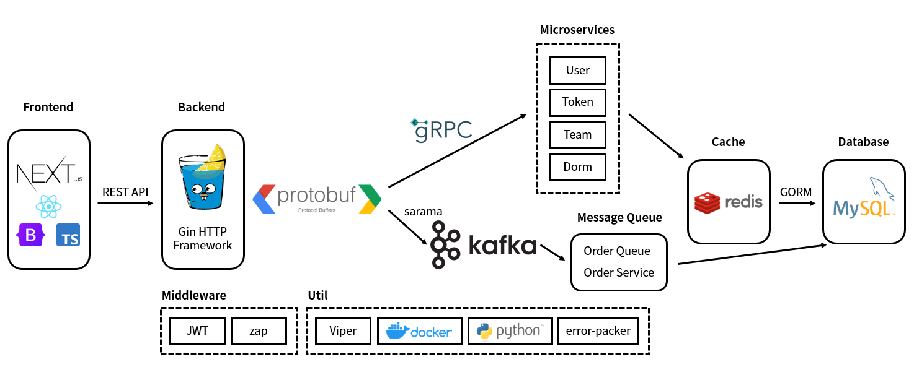

# dorm-system

基于微服务架构的高并发宿舍秒杀系统

[English](./README.md) | [中文](./README-cn.md)

## 架构



## 依赖

### 后端 (Go)

| Name   | Usage        | URL                          |
| :----- | ------------ | ---------------------------- |
| Gin    | HTTP 框架    | github.com/gin-gonic/gin     |
| gRPC   | gRPC         | google.golang.org/grpc       |
| sarama | Kafka 连接器 | github.com/Shopify/sarama    |
| GORM   | MySQL 连接器 | gorm.io/gorm                 |
| Viper  | 配置文件管理 | github.com/spf13/viper       |
| zap    | 日志管理     | go.uber.org/zap              |
| JWT    | JWT          | github.com/golang-jwt/jwt/v4 |

### 前端 (TypeScript)

| Name      | Usage      | URL                                 |
| --------- | ---------- | ----------------------------------- |
| Next.js   | React 框架 | <https://github.com/vercel/next.js> |
| React     | React      | <https://github.com/facebook/react> |
| Bootstrap | CSS        | <https://github.com/twbs/bootstrap> |

## 使用 Docker 部署项目

### 部署数据库

下方的 Docker compose 脚本将自动部署 MySQL 和 Redis

```shell
cd scripts/docker_db
sudo docker compose up -d
```

默认参数如下：

| Key                 | Value      |
| ------------------- | ---------- |
| MySQL root password | root       |
| MySQL port          | 3306       |
| Redis auth password | redis_pass |
| Redis port          | 6379       |

### 生成虚拟数据

通过运行 Python 脚本生成虚拟数据，如需修改配置请在 `util.py` 中修改

```shell
cd scripts/python
python3 main.py
```

生成数据

| Data         | Value                                                        |
| ------------ | ------------------------------------------------------------ |
| 宿舍楼       | 5 个启用, 1 个未启用                                         |
| 宿舍         | 100 个宿舍，随机性别和床位数                                 |
| 用户（学生） | 约 1000 个性别和姓名都随机的用户，每个用户有对应的账户       |
| 测试用户     | 用户名：temp；密码：temp                                     |
| 队伍         | 1 个已经组好的队，包含测试用户和 4 个测试队友（temp1 ~ temp4） |

### 部署消息队列

通过 Docker 部署 Kafka 和 ZooKeeper

```shell
cd scripts/docker_kafka
sudo docker compose up -d
```

默认参数如下

| Key                     | Value     |
| ----------------------- | --------- |
| Kafka port              | 19092     |
| Kafka security protocol | PLAINTEXT |

### 部署微服务

使用 Docker 部署微服务（共计 6 个：main, dorm, order, team, token, user）

```shell
docker compose up -d
```

此操作会以单节点形式部署全部服务，如需分布式部署请 build 单独的 `Dockerfile`

请在 `configs/` 目录下修改配置文件

### 部署前端

```shell
cd web/dorm-system-frontend
docker build -t dorm-system-frontend .
docker run -dp 3000:3000 --name dorm-system-frontend dorm-system-frontend
```

完成上述全部步骤后即可通过端口 3000 访问整个系统
