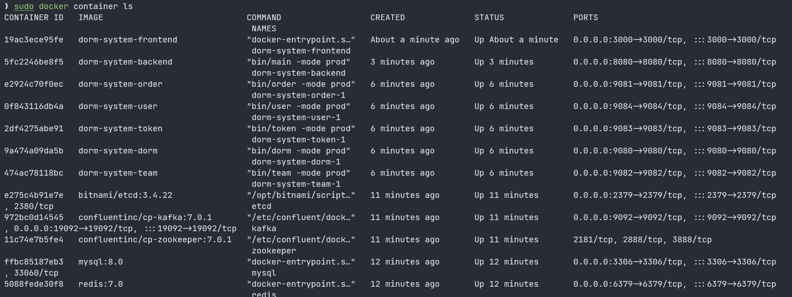

# dorm-system

基于微服务架构的高并发宿舍秒杀系统

[English](./README.md) | [中文](./README-cn.md)

- [dorm-system](#dorm-system)
  - [架构](#架构)
  - [依赖](#依赖)
    - [后端 (Go)](#后端-go)
    - [前端 (TypeScript)](#前端-typescript)
  - [文件结构](#文件结构)
  - [使用 Docker 部署项目](#使用-docker-部署项目)
    - [部署数据库](#部署数据库)
    - [生成虚拟数据](#生成虚拟数据)
    - [部署消息队列](#部署消息队列)
    - [部署 etcd](#部署-etcd)
    - [部署微服务](#部署微服务)
    - [部署主服务](#部署主服务)
    - [部署前端](#部署前端)

## 架构


## 依赖

### 后端 (Go)

| Name   | Usage     | URL                          |
|:-------|-----------|------------------------------|
| Gin    | HTTP 框架   | github.com/gin-gonic/gin     |
| gRPC   | gRPC      | google.golang.org/grpc       |
| sarama | Kafka 连接器 | github.com/Shopify/sarama    |
| etcd   | 服务注册 & 发现 | go.etcd.io/etcd/client/v3    |
| GORM   | MySQL 连接器 | gorm.io/gorm                 |
| Viper  | 配置文件管理    | github.com/spf13/viper       |
| zap    | 日志管理      | go.uber.org/zap              |
| JWT    | JWT       | github.com/golang-jwt/jwt/v4 |

### 前端 (TypeScript)

| Name      | Usage    | URL                                 |
|-----------|----------|-------------------------------------|
| Next.js   | React 框架 | <https://github.com/vercel/next.js> |
| React     | React    | <https://github.com/facebook/react> |
| Bootstrap | CSS      | <https://github.com/twbs/bootstrap> |

## 文件结构

本项目的文件结构主要参考了 [golang-standards/project-layout](https://github.com/golang-standards/project-layout)

```text
dorm-system
├─api => API 文档
├─assets => 静态资源
├─bin => 二进制可执行文件
├─cmd => 运行/编译命令
├─configs => 配置文件
├─internal => 主程序代码
│  ├─api => Protocol Buffers
│  ├─cache => Redis
│  ├─controller => Gin
│  ├─cookie => Cookie 管理
│  ├─dal => 数据持久层 (MySQL)
│  ├─handler => Gin 处理器
│  ├─middleware => JWT, CORS
│  ├─mq => Kafka 消息队列
│  ├─rpc => gRPC
│  ├─service => 微服务
│  └─util => 工具函数
├─logs
├─pkg => 外部代码
│  ├─ep => error-packer
│  ├─gmp => go mod path
│  ├─jwt
│  ├─viperpkg => Viper
│  └─zap
├─scripts
│  ├─docker_db => MySQL 和 Redis 的 Docker Compose
│  ├─docker_etcd => etcd 的 Docker Compose
│  ├─docker_frontback => 前后端的 Docker build
│  ├─docker_kafka => Kafka 的 Docker Compose
│  ├─http => HTTP API 测试
│  └─python => 创建虚拟数据
├─test
└─web
    └─dorm-system-frontend => 前端 (Next.js)
```

## 使用 Docker 部署项目

本项目为微服务架构，但按此步骤执行可以完成单节点部署，且无需修改配置文件

### 部署数据库

下方的 Docker compose 脚本将自动部署 MySQL 和 Redis

```shell
cd scripts/docker_db
sudo docker compose up -d
```

默认参数如下：

| Key                 | Value      |
|---------------------|------------|
| MySQL root password | root       |
| MySQL port          | 3306       |
| Redis auth password | redis_pass |
| Redis port          | 6379       |

### 生成虚拟数据

通过运行 Python 脚本生成虚拟数据，如需修改配置请在 `util.py` 中修改

```shell
cd scripts/python/mock-data
python3 main.py
```

生成数据

| Data   | Value                                    |
|--------|------------------------------------------|
| 宿舍楼    | 5 个启用, 1 个未启用                            |
| 宿舍     | 100 个宿舍，随机性别和床位数                         |
| 用户（学生） | 约 1000 个性别和姓名都随机的用户，每个用户有对应的账户           |
| 测试用户   | 用户名：temp；密码：temp                         |
| 队伍     | 1 个已经组好的队，包含测试用户和 4 个测试队友（temp1 ~ temp4） |

### 部署消息队列

通过 Docker Compose 部署 Kafka 和 ZooKeeper

```shell
cd scripts/docker_kafka
sudo docker compose up -d
```

默认参数如下

| Key                     | Value     |
|-------------------------|-----------|
| Kafka port              | 19092     |
| Kafka security protocol | PLAINTEXT |

### 部署 etcd

通过 Docker Compose 部署 etcd

```shell
cd scripts/docker_etcd
sudo docker compose up -d
```

### 部署微服务

使用 Docker Compose 部署微服务（共计 5 个：dorm, order, team, token, user）

```shell
sudo docker compose up -d
```

此操作会以单节点形式部署全部服务，如需分布式部署（或服务器配置不足以同时 build 全部镜像）请 build 单独的 `Dockerfile`

```shell
sudo docker build -t dorm-system-dorm -f Dockerfile-dorm .
sudo docker build -t dorm-system-order -f Dockerfile-order .
sudo docker build -t dorm-system-team -f Dockerfile-team .
sudo docker build -t dorm-system-token -f Dockerfile-token .
sudo docker build -t dorm-system-user -f Dockerfile-user .
sudo docker compose up -d
```

请在 `configs/` 目录下修改配置文件

### 部署主服务

主服务需在其他微服务已经完成部署的前提下部署

```shell
sudo sh scripts/docker_frontback/build_backend.sh
```

### 部署前端

```shell
sudo sh scripts/docker_frontback/build_frontend.sh
```

完成上述全部步骤后，容器列表应当如下图所示



现在可以通过端口 3000 访问整个系统

如想了解更多信息，请参考 [projects/dorm-system](https://zengyh.com/projects/dorm-system)
