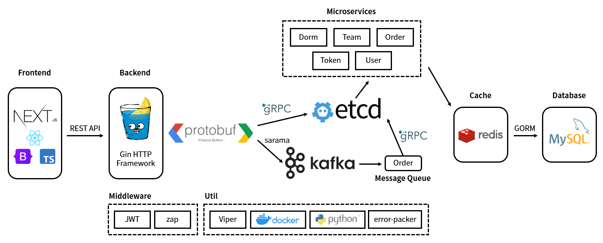

# dorm-system

A dormitory selecting system in microservice architecture which supports high concurrency, written in Go.

[English](./README.md) | [中文](./README-cn.md)

- [dorm-system](#dorm-system)
  - [Architecture](#architecture)
  - [Dependencies](#dependencies)
    - [Backend (Go)](#backend-go)
    - [Frontend (TypeScript)](#frontend-typescript)
  - [File Layout](#file-layout)
  - [Getting started](#getting-started)
    - [Set up the databases](#set-up-the-databases)
    - [Create dummy data](#create-dummy-data)
    - [Set up the message queue](#set-up-the-message-queue)
    - [Set up the etcd](#set-up-the-etcd)
    - [Build the microservices](#build-the-microservices)
    - [Run microservices](#run-microservices)
      - [Alternative method: use Docker](#alternative-method-use-docker)
    - [Run frontend](#run-frontend)
      - [Alternative method: use Docker](#alternative-method-use-docker-1)

## Architecture



## Dependencies

### Backend (Go)

| Name   | Usage                        | URL                          |
|:-------|------------------------------|------------------------------|
| Gin    | HTTP Framework               | github.com/gin-gonic/gin     |
| gRPC   | gRPC                         | google.golang.org/grpc       |
| sarama | Kafka Connector              | github.com/Shopify/sarama    |
| etcd   | Service Registry & Discovery | go.etcd.io/etcd/client/v3    |
| GORM   | MySQL ORM                    | gorm.io/gorm                 |
| Viper  | Configuration                | github.com/spf13/viper       |
| zap    | Logging                      | go.uber.org/zap              |
| JWT    | JWT                          | github.com/golang-jwt/jwt/v4 |

### Frontend (TypeScript)

| Name      | Usage           | URL                                 |
|-----------|-----------------|-------------------------------------|
| Next.js   | React Framework | <https://github.com/vercel/next.js> |
| React     | React           | <https://github.com/facebook/react> |
| Bootstrap | CSS             | <https://github.com/twbs/bootstrap> |

## File Layout

The file layout in this project heavily
referenced [golang-standards/project-layout](https://github.com/golang-standards/project-layout)

```text
dorm-system
├─api => API document
├─assets => public resources
├─bin => binary executables
├─cmd => commands
├─configs => configurations
├─internal => main code
│  ├─api => Protocol Buffers
│  ├─cache => Redis
│  ├─controller => Gin
│  ├─cookie => Cookie management
│  ├─dal => data access layer (MySQL)
│  ├─handler => Gin handlers
│  ├─middleware => JWT, CORS
│  ├─mq => Kafka message queue
│  ├─rpc => gRPC
│  ├─service => microservices
│  └─util => utilities
├─logs
├─pkg => external code
│  ├─ep => error-packer
│  ├─gmp => go mod path
│  ├─jwt
│  ├─viperpkg => Viper
│  └─zap
├─scripts
│  ├─docker_db => Docker Compose for MySQL and Redis
│  ├─docker_etcd => Docker Compose for etcd
│  ├─docker_frontback => Docker build frontend and backend
│  ├─docker_kafka => Docker Compose for Kafka
│  ├─http => HTTP API testing
│  └─python => create dummy data
├─test
└─web
    └─dorm-system-frontend => frontend (Next.js)
```

## Getting started

### Set up the databases

This project uses two databases: MySQL and Redis, Redis is for caching. By default they run in Docker containers, you
can use a Docker Compose command to set them both up.

```shell
cd scripts/docker_db
sudo docker compose up -d
```

The default configurations are as below, change them in `docker-compose.yml` and `redis.conf`:

| Key                 | Value      |
|---------------------|------------|
| MySQL root password | root       |
| MySQL port          | 3306       |
| Redis auth password | redis_pass |
| Redis port          | 6379       |

### Create dummy data

Use Python scripts to create dummy data, change the MySQL configuration in `util.py` and run:

```shell
cd scripts/python/mock-data
pip install faker mysql-connector-python
python3 main.py
```

This will create the data below:

| Data      | Value                                                                         |
|-----------|-------------------------------------------------------------------------------|
| buildings | 5 enabled, 1 not enabled                                                      |
| dorms     | 100 dorms with random gender and bed counts                                   |
| users     | ~1000 users with random gender and name, along with the correspondent account |
| test user | username: temp; password: temp                                                |
| teams     | 1 team: test user + first four users (temp1 ~ temp4)                          |

### Set up the message queue

Kafka and ZooKeeper also run in Docker containers:

```shell
cd scripts/docker_kafka
sudo docker compose up -d
```

Default configurations are as below, change them in `docker-compose.yml`

| Key                     | Value     |
|-------------------------|-----------|
| Kafka port              | 19092     |
| Kafka security protocol | PLAINTEXT |

### Set up the etcd

Using Docker Compose

```shell
cd scripts/docker_etcd
sudo docker compose up -d
```

### Build the microservices

Use Makefile to build all executable files in one command:

```shell
make -C cmd build-all
```

All binary executable files are located in `bin/`

The program read configuration files at runtime, modify them in `configs/`

### Run microservices

```shell
sudo bin/[main|dorm|order|team|token|user] -mode=[dev|prod|test]
```

The mode decides which configuration file to read.

Be aware that the main service should be run AFTER all other services.

#### Alternative method: use Docker

All microservices can run in Docker from one command using Docker Compose:

```shell
sudo docker compose up -d
```

After running all microservice containers, run main service using Dockerfile:

```shell
sudo sh scripts/docker_frontback/build_backend.sh
```

### Run frontend

Change the IP address to your backend server's IP in `next.config.js`

```shell
cd web/dorm-system-frontend
npm i
npm run start
```

#### Alternative method: use Docker

Run frontend in Docker container from one command:

```shell
sudo sh scripts/docker_frontback/build_frontend.sh
```

If you use Docker to set up all modules, then your container list should look like this:


Now you should be able to explore the whole system in your browser at `localhost:3000`, enjoy!
